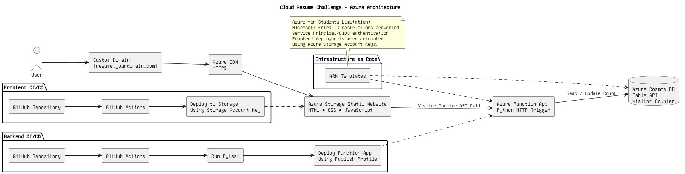
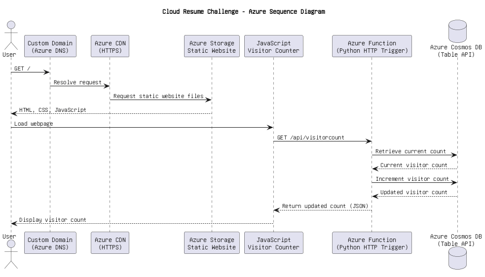

# Cloud Resume Challenge (Azure)
Personal Project
- Built and deployed a serverless resume website on Microsoft Azure using Python, Azure Functions, Cosmos DB, Azure Storage Static Websites, and GitHub Actions.
- Developed a visitor counter API and integrated it with a static frontend hosted in Azure.
- Implemented CI/CD pipelines to automate testing and deployment of frontend and backend components.
- Utilized Azure services including Storage Accounts, Functions, networking, and identity to build and operate the solution end-to-end.
- Designed and managed the project within the constraints of an Azure for Students subscription, optimizing resource usage and costs.

---

## Architecture Diagram
This diagram provides an overview of the Azure services and deployment workflows used to build and automate the solution.
<p align="center">
  
</p>


## Application Flow

```text
User visits the resume website
        ↓
Frontend sends a request to the visitor counter API
        ↓
Azure Function retrieves the current count from Cosmos DB
        ↓
The count is incremented and updated in the database
        ↓
The updated visitor count is returned to the frontend
        ↓
The website displays the latest visitor count
```
## Sequence Diagram

This diagram illustrates how a visitor request flows through the application and how the visitor counter is updated.
<p align="center">
  
</p>

## Repository Structure

```text
.
├── frontend/          # Static website files
├── backend/           # Azure Function and tests
├── images/            # Diagrams and screenshots
└── .github/workflows/ # CI/CD pipelines
```

## Technologies Used
- Technologies
- Azure Storage Static Website
- Azure CDN
- Azure Functions
- Cosmos DB Table API
- Python
- pytest
- JavaScript
- GitHub Actions


---
## Azure Services Used

| Service | Purpose |
|----------|----------|
| Azure Static Web Apps | Hosts the resume frontend |
| Azure Functions | Provides the visitor counter API |
| Azure Cosmos DB | Stores visitor count data |
| GitHub Actions | Automates deployment workflows |

## Azure for Students Challenges

The Azure for Students subscription restricted Microsoft Entra ID permissions required for Service Principals and OIDC authentication.
To maintain automated deployments:
- Backend deployments use an Azure Function publish profile stored as a GitHub Secret.
- Frontend deployments authenticate using Azure Storage Account Access Keys.
- No credentials are committed to source control.</br>

This experience reinforced the importance of adapting solutions to real-world constraints while maintaining secure and automated workflows.

---

## Future Improvements

Potential enhancements include:
- Azure Application Insights monitoring
- Automated testing coverage
- Bicep/Terraform


